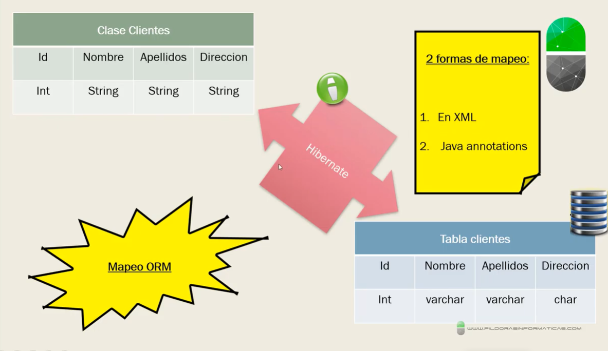
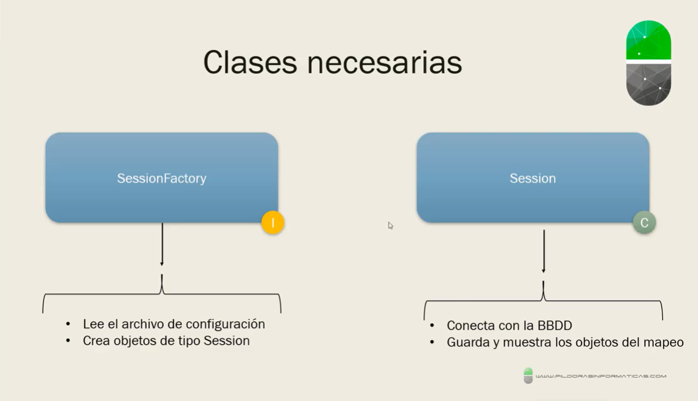
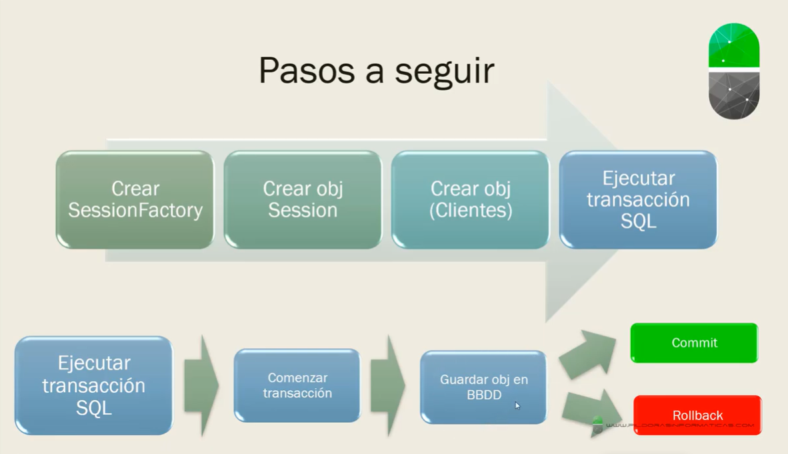

# Hibernate Ejemplo 1



# 1. Creamos el proyecto

- Creamos un proyecto maven con el arquetipo de webapps.
- Añadimos el JDK-19
- Añadimos las dependencias de Hibernate y el plugin del compiler, etc
- Maven install, y Update Project

# 2. src/main/resources --> hibernate.cfg.xml

```xml
<?xml version="1.0" encoding="UTF-8"?>
<!DOCTYPE hibernate-configuration PUBLIC "-//Hibernate/Hibernate Configuration DTD 3.0//EN" "http://www.hibernate.org/dtd/hibernate-configuration-3.0.dtd">

<hibernate-configuration>
	<session-factory>
 		<property name="connection.driver_class">org.postgresql.Driver</property>
 	    <property name="connection.url">jdbc:postgresql://localhost/hibernate-example-1</property>
		<property name="connection.username">postgres</property>
		<property name="connection.password">12345</property>
		<property name="dialect">org.hibernate.dialect.PostgreSQLDialect</property>
		<property name="hibernate.show_sql">true</property>
		<property name="hibernate.hbm2ddl.auto">create</property>
	</session-factory>
</hibernate-configuration>
```





# 3. com.example.models --> Customer.java

**Nota**: en vez de la librería por defecto de *javax*, voy a utilizar la de *jakarta*.

```java
package com.example.models;

import jakarta.persistence.Column;
import jakarta.persistence.Entity;
import jakarta.persistence.GeneratedValue;
import jakarta.persistence.GenerationType;
import jakarta.persistence.Id;
import jakarta.persistence.Table;

@Entity
@Table(name = "customers")
public class Customer {

	/************************************************** ATRIBUTOS ******************************************/
	@Id
	@Column(name = "Id")
	@GeneratedValue(strategy = GenerationType.IDENTITY)
	private int id;
	
	@Column(name = "Name")
	private String name;
	
	@Column(name = "Surname")
	private String surname;
	
	@Column(name = "Address")
	private String address;

	
	/************************************************** CONSTRUCTORES ******************************************/
	public Customer(String name, String surname, String address) {
		super();
		this.name = name;
		this.surname = surname;
		this.address = address;
	}


	public Customer() {
		super();
	}


	/************************************************** GETTERS Y SETTERS ******************************************/
	public int getId() {
		return id;
	}


	public void setId(int id) {
		this.id = id;
	}


	public String getName() {
		return name;
	}


	public void setName(String name) {
		this.name = name;
	}


	public String getSurname() {
		return surname;
	}


	public void setSurname(String surname) {
		this.surname = surname;
	}


	public String getAddress() {
		return address;
	}


	public void setAddress(String address) {
		this.address = address;
	}
	
	
	/************************************************** ToString ******************************************/
	@Override
	public String toString() {
		return "\nCustomer [id=" + id + ", name=" + name + ", surname=" + surname + ", address=" + address + "]";
	}
}
```

# 4. com.example.main --> Main.java

```java
package com.example.main;

import org.hibernate.Session;
import org.hibernate.SessionFactory;
import org.hibernate.cfg.Configuration;

import com.example.models.Customer;

public class Main {

	public static void main(String[] args) {
		// TODO Auto-generated method stub

		SessionFactory sessionFactory = new Configuration().configure("hibernate.cfg.xml").addAnnotatedClass(Customer.class).buildSessionFactory();
		Session session = sessionFactory.openSession();
		
		try {
			Customer customer1 = new Customer("sergio", "diaz", "avenida del aprobado");
			
			session.beginTransaction();
			// session.save(customer1); // deprecated method
			session.persist(customer1);
			session.getTransaction().commit();
			
			System.out.println("The new customer was added successfully");
			session.close();
			
		} finally {
			// TODO: handle finally clause
			sessionFactory.close();
		}
	}
}
```

# 5. Prueba de ejecución del proyecto

https://github.com/csi21-sdiapos/hibernate-example-1/issues/1